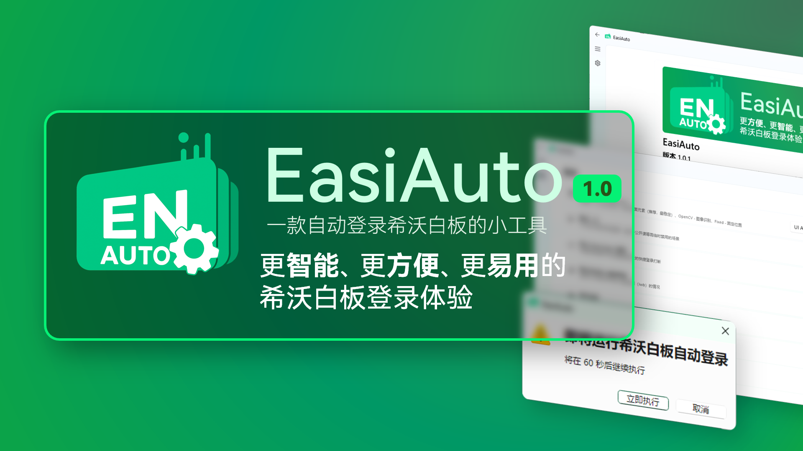

<div align="center">



一款自动登录希沃白板的小工具，通过模拟登录流程来实现自动登录。

[](https://github.com/hxabcd/EasiAuto/releases/latest)
[](https://github.com/hxabcd/EasiAuto/commits/master)
[](https://github.com/hxabcd/EasiAuto/releases)

[-821944413-blue.svg)](https://qm.qq.com/q/5TV3Pvb2M2)
[](https://space.bilibili.com/401002238)

[](https://python.org)
[](https://doc.qt.io/qtforpython/)
[](https://docs.astral.sh/uv/)
[](https://sentry.io/)
[](LICENSE)

</div>


> [!NOTE]
> 推荐同时安装 [ClassIsland](https://github.com/ClassIsland/ClassIsland/)，在指定课程开始时自动执行登录任务，实现全自动登录的智慧教学新体验。
> 
> 可在软件的「自动化」界面中快速配置 ClassIsland 自动化。


> [!NOTE]
> 系统需求：Windows 10 及以上版本

下载（官网）：https://easiauto.0xabcd.dev

## ✨亮点

* **易用的设置界面**：前所未有的 ClassIsland 自动化编辑体验，简单几步即可配置完成
* **完备的登录方式**：具有 固定位置、图像识别、自动定位、进程注入 四种登录方案，根据需求灵活切换
* **运行前显示警告弹窗**：自动运行不再措不及防，还可暂时推迟登录
* **醒目的横幅警示**：兼具实用性与视觉冲击力，同时支持高度自定义
* **单次跳过**：暂时禁用自动登录，满足特殊场景下的灵活需求
* **错误重试**：无惧登录流程被打断
* **自动更新**：及时接收功能增强和问题修复

## 🖼️ 截图

<details>
<summary> 📸 点击这里展开 📸 </summary>

<div align="center">

 <br> 警示横幅

 <br> 运行前警告弹窗

 <br> 设置页

 <br> 自动化页

 <br> 更新页

</div>

</details>

## 🪄 使用

下载后，将程序解压缩到你指定的文件夹，随后双击 `EasiAuto.exe` 启动程序。

在设置界面中可更改配置项，在自动化页添加档案到 ClassIsland，同时也可以创建快捷方式到桌面。

此外，通过命令行进行调用的方法如下：

```pwsh
# 运行自动登录
.\EasiAuto.exe login -a ACCOUNT -p PASSWORD

# 跳过下一次登录
.\EasiAuto.exe skip

# 查看完整使用说明
.\EasiAuto.exe -h
```
